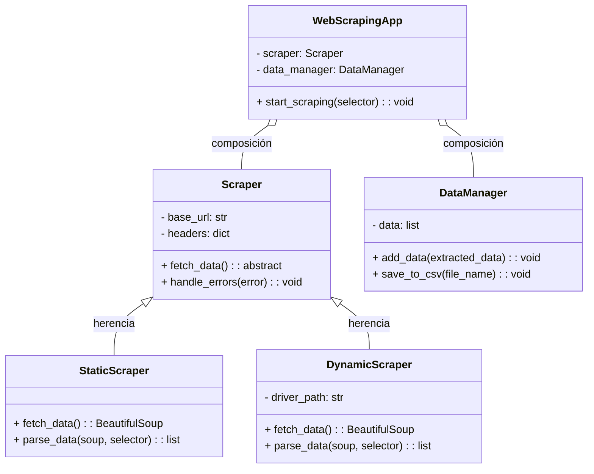

Avance 1 - 15% (Definición de alternativa - Diagramas de clases - Solución preliminar)

# 🌐 Sistema WebScrapping

## 🗒️ Colaboradores

```
├── Santiago Gamboa Martínez
├── Samuel Eduardo Fajardo Quintero
└── Manuel Felipe Torres Gamboa
```

## 🏆 Introducción

En el contexto actual, donde la cantidad de información disponible en internet crece de manera exponencial, la extracción eficiente de datos relevantes se ha convertido en una necesidad crucial para diversos sectores. El desarrollo de un sistema de web scraping representa una solución tecnológica para obtener, procesar y analizar información de forma automatizada desde sitios web. Por esta razón, como equipo, hemos elegido desarrollar la `alternativa 2`: **_Sistema de WebScrapping_**, este proyecto propone el diseño e implementación de un sistema de web scraping que no solo cumpla con los objetivos de extracción de datos, sino que esté estructurado bajo los principios fundamentales de la Programación Orientada a Objetos (POO).

La elección de POO como paradigma principal radica en su capacidad para ofrecer una arquitectura modular, reutilizable y escalable, cualidades esenciales en un proyecto de esta naturaleza. Mediante el uso de conceptos como encapsulación, herencia, composición, polimorfismo y abstracción, el sistema garantizará un diseño robusto que permita extender sus funcionalidades de manera eficiente y manejar la complejidad inherente al tratamiento de datos en entornos estáticos y dinámicos.

Este proyecto no solo busca cumplir con los objetivos técnicos del desarrollo de un sistema funcional, sino también destacar el valor pedagógico de aplicar los pilares de POO en un contexto práctico. De esta manera, se contribuye al fortalecimiento de habilidades de diseño y programación, alineándose con los requerimientos académicos y profesionales.

## ➕ Definición de Alternativa

La alternativa para este proyecto consiste en el desarrollo de un sistema de web scraping que emplee como pilar principal la Programación Orientada a Objetos (POO). El sistema será desarrollado en Python, un lenguaje ampliamente reconocido por su versatilidad y su extenso ecosistema de librerías diseñadas para la extracción y manipulación de datos desde la web.

### Características principales:

1. **Aplicación de POO**:  
   El diseño del sistema estará basado en los pilares de POO:

   - **Encapsulación** para proteger y organizar datos.
   - **Abstracción** para simplificar la interacción con el sistema.
   - **Herencia** para evitar redundancias y fomentar la reutilización de código.
   - **Polimorfismo** para permitir extensibilidad y personalización.

2. **Uso de Python y sus librerías especializadas**:

   - **Requests**: Para realizar solicitudes HTTP y acceder al contenido de las páginas web.
   - **BeautifulSoup** (de la biblioteca bs4): Para parsear HTML y extraer información estructurada.
   - **Selenium** (si se requiere interacción dinámica): Para manejar sitios web que cargan contenido de forma asíncrona o que requieren simulación de usuarios.
   - **Pandas**: Para procesar y almacenar los datos extraídos en formatos como CSV o bases de datos.

3. **Requerimientos tecnológicos adicionales**:
   - **Gestión de dependencias**: Uso de herramientas como `pip` o archivos `requirements.txt` para garantizar la instalación de librerías necesarias.
   - **Control de versiones**: Implementación de Git para mantener un historial claro del desarrollo y facilitar la colaboración en equipo.
   - **Entorno de ejecución**: Uso de entornos virtuales (`venv`) para asegurar compatibilidad y aislamiento de dependencias.
   - **Persistencia de datos**: Almacenamiento de la información extraída en formatos accesibles, como bases de datos SQLite o archivos JSON/CSV.

### Ventajas de esta alternativa:

- Facilita la organización y escalabilidad del sistema gracias a la implementación de POO.
- Aprovecha el amplio ecosistema de Python, que incluye librerías maduras y bien documentadas.
- Brinda flexibilidad para adaptarse a diversas necesidades, como la extracción de datos estáticos o dinámicos.
- Fomenta la adquisición de habilidades de diseño y codificación estructurada para su aplicación en escenarios reales.

## 📈 Diagrama de Clases



### **Explicación de los Pilares de POO**

1. **Herencia**  
   - **Dónde se aplica**: La clase `Scraper` es la clase base abstracta de la cual derivan `StaticScraper` y `DynamicScraper`.  
   - **Por qué es importante**: Permite reutilizar código común entre los diferentes tipos de scrapers, reduciendo duplicación y facilitando mantenimiento.  

2. **Abstracción**  
   - **Dónde se aplica**: La clase `Scraper` define el método abstracto `fetch_data`, que las subclases implementan según sus propias necesidades.  
   - **Por qué es importante**: Oculta los detalles específicos del scraping (estático o dinámico) al usuario del sistema, ofreciendo una interfaz clara.  

3. **Polimorfismo**  
   - **Dónde se aplica**: El método `fetch_data` es implementado de manera distinta en `StaticScraper` y `DynamicScraper`, pero ambas subclases pueden ser usadas de manera intercambiable en el sistema.  
   - **Por qué es importante**: Permite que el sistema maneje diferentes tipos de scrapers sin necesidad de modificar el código principal de la aplicación.  

4. **Encapsulación**  
   - **Dónde se aplica**: Atributos como `base_url`, `headers` y `driver_path` son protegidos o privados, asegurando que solo las propias clases o subclases tengan acceso directo a ellos.  
   - **Por qué es importante**: Mantiene los datos seguros y previene que sean modificados de forma indebida desde fuera de las clases.  

5. **Composición**  
   - **Dónde se aplica**: La clase `WebScrapingApp` utiliza instancias de `Scraper` (o sus subclases) y `DataManager`.  
   - **Por qué es importante**: Fomenta la modularidad, ya que permite que los componentes del sistema interactúen entre sí sin estar fuertemente acoplados.  
