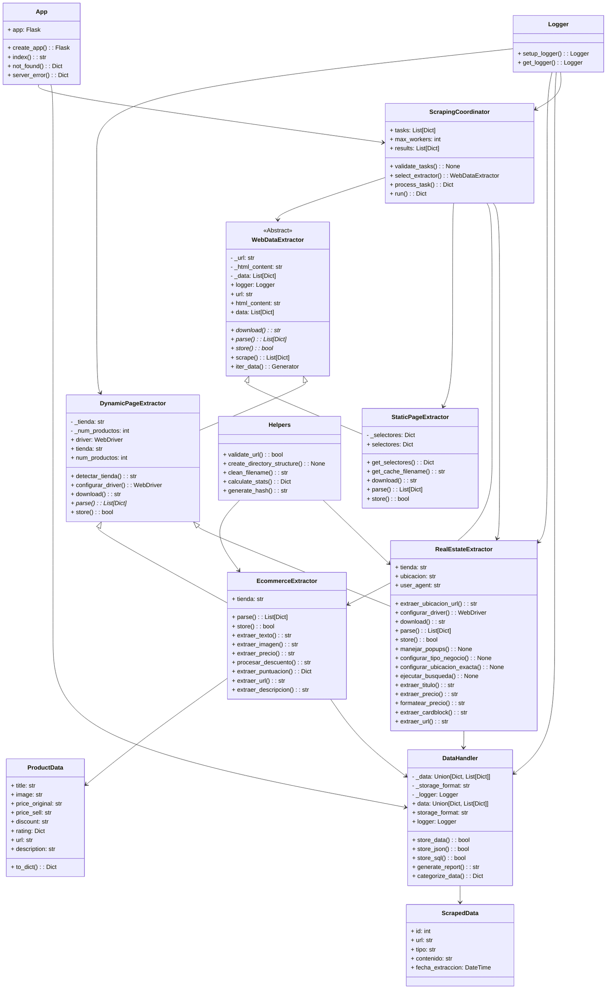

# 🌐 Sistema WebScrapping

## 🗒️ Colaboradores

```
├── Santiago Gamboa Martínez
├── Samuel Eduardo Fajardo Quintero
└── Manuel Felipe Torres Gamboa
```

# 🏆 Introducción

El volumen de información que se encuentra disponible en internet crece de manera exponencial, haciendo indispensable el uso de herramientas tecnológicas que permitan extraer y analizar datos relevantes de forma automática y eficiente. Por esta razón, como equipo, hemos elegido desarrollar la `alternativa 2`: **_Sistema de WebScrapping_**, este proyecto consiste en desarrollar e implementar un sistema de web scraping que no solo cumpla con los objetivos de extracción de datos, sino que también esté estructurado bajo los principios fundamentales de la Programación Orientada a Objetos (POO).

Este proyecto, titulado: "Super_Proyecto_Final", tiene como objetivo diseñar un sistema de web scraping estructurado bajo principios de modularidad y escalabilidad. Para ello, se emplearán herramientas como Python junto a librerías especializadas como Requests, BeautifulSoup, Selenium y Pandas. Además, se garantizará un desarrollo robusto mediante buenas prácticas, como el manejo adecuado de excepciones y una organización eficiente del código estructurado bajo el paradigma de Programación Orientada a Objetos (POO).

# ➕ Definición de Alternativa

La alternativa para este proyecto consiste en el desarrollo de un sistema de web scraping que emplee como pilar principal la Programación Orientada a Objetos (POO). El sistema, como ya se mencionó anteriormente, será desarrollado en Python, un lenguaje ampliamente reconocido por su versatilidad y su extenso ecosistema de librerías diseñadas para la extracción y manipulación de datos desde la web, ademas, se contará con la implementación de un entorno virtual en el cual se instalarán las dependencias necesarias para desarrollar y ejecutar este sistema de web scraping.

### Ventajas de esta alternativa:

- Facilita la organización y escalabilidad del sistema gracias a la implementación de Programación Orientada a Objetos (POO).
- Aprovecha el amplio ecosistema y la versatilidad de Python, que incluye librerías robustas que a su vez estan bien documentadas.
- Brinda flexibilidad para adaptarse a diversas necesidades, como la extracción de datos estáticos o dinámicos dependiendo el caso.
- Fomenta la adquisición de habilidades de diseño y codificación para su aplicación en escenarios reales.

# 🗂️ Requerimientos Técnicos:

### 1. **Lenguaje y Librerías**:

- Python como lenguaje principal.

### **Librerías**:

- **`Requests`** para realizar solicitudes HTTP.
- **`BeautifulSoup`** para parsear y extraer datos de HTML.

- **`Selenium`** para interactuar con páginas dinámicas.
- **`Pandas`** para almacenar y procesar datos en estructuras organizadas.

### 2. **Estructura del Código**:

Implementación bajo los principios de la Programación Orientada a Objetos (POO) para garantizar modularidad y escalabilidad.

### **Clases principales**:

- **`WebDataExtractor`** (base).
- **`StaticPageExtractor`** y **`DynamicPageExtractor`** (derivadas).
- **`DataHandler`** para gestionar los datos.
- **`ScrapingCoordinator`** para coordinar el flujo del sistema.

### 3. **Entorno de Desarrollo**:

- Uso de entornos virtuales para aislamiento de dependencias (venv).
- Gestión de versiones con Git para colaboración y control del progreso.
- Archivo **`requirements.txt`** para especificar las dependencias del proyecto.

### 4. **Salida de Datos**:

Soporte para formatos CSV, JSON o almacenamiento en bases de datos SQLite.

### 5. **Otros Requerimientos**:

Capacidad de manejar excepciones para evitar interrupciones en la ejecución.
Compatibilidad con sitios web tanto estáticos como dinámicos.

# 🛠️ Configuración del Entorno de Trabajo

### **1. Clonar el repositorio**:

Descargar el código fuente con los siguientes comandos:

```bash
git clone https://github.com/santgm56/Super-Proyecto-Final.git
cd Super-Proyecto-Final
```

### **2. Crear y activar un entorno virtual**:

El uso de un entorno virtual ayuda a instalar las dependencias del proyecto sin interferir con otras aplicaciones de Python.

**En Windows**:

```bash
python -m venv venv
.\venv\Scripts\activate
```

**En macOS/Linux**:

```bash
python -m venv venv
source venv/bin/activate
```

### **3. Instalar las dependencias**:

Una vez dentro del entorno virtual, ejecutar:

```bash
pip install -r requirements.txt
```

### **5. Salir del entorno virtual**:

Al terminar de trabajar o hacer modificaciones, se puede salir del entorno virtual escribiendo:

```bash
deativate
```

### **Nota adicional**:

Si se usa Windows y existe algún problema al activar el entorno virtual, es posible que se necesite habilitar la ejecución de scripts por políticas de resticción en powershell. Para corregirlo, basta con ejecutar estos comandos en el CMD como terminal predeterminada ya que esta no cuenta con dichas condiciones.


# ✨ Estructura del proyecto

```plaintext
SUPER_PROYECTO_FINAL/
├── README.md
├── requirements.txt
├── .gitignore
├── setup.py
├── main.py
├── src/
│   ├── _init_.py
│   ├── base/
│   │   ├── _init_.py
│   │   └── web_data_extractor.py     # Clase base WebDataExtractor
│   ├── components/
│   │   ├── _init_.py
│   │   ├── static_page_extractor.py  # Clase derivada StaticPageExtractor
│   │   ├── dynamic_page_extractor.py # Clase derivada DynamicPageExtractor
│   │   └── data_handler.py           # Clase DataHandler
│   ├── coordinator/
│   │   ├── _init_.py
│   │   └── scraping_coordinator.py   # Clase ScrapingCoordinator
│   └── utils/
│       ├── _init_.py
│       └── helpers.py                # Funciones auxiliares
├── tests/
│   ├── _init_.py
│   ├── test_static_page_extractor.py  # Pruebas unitarias de StaticPageExtractor
│   ├── test_dynamic_page_extractor.py # Pruebas unitarias de DynamicPageExtractor
│   ├── test_web_data_extractor.       # Pruebas unitarias de WebDataExtractor
│   ├── test_data_handler.py           # Pruebas unitarias de DataHandler
│   └──test_scraping_coordinator       # Pruebas unitarias de ScrapingCoordinator
├── logs/
│      error.log                      # Para errores críticos.
│      activiti.log                   # Para registrar eventos generales del scraping.
└── outputs/
```

El proyecto está organizado de manera modular y jerárquica, siguiendo buenas prácticas de desarrollo de software. A continuación, se explica cada componente y su importancia, así como las ventajas de utilizar esta estructura:

### **1. Archivos Raíz**
- **`README.md`**:  
  - **Importancia**: Es la primera impresión del proyecto. Proporciona una descripción general, instrucciones de instalación, uso y documentación clave.  
  - **Ventajas**: Facilita la comprensión del proyecto para nuevos desarrolladores o colaboradores. Es esencial para proyectos open-source o colaborativos.  

- **`requirements.txt`**:  
  - **Importancia**: Lista todas las dependencias necesarias para ejecutar el proyecto.  
  - **Ventajas**: Permite replicar el entorno de desarrollo fácilmente con `pip install -r requirements.txt`. Asegura que todos los colaboradores usen las mismas versiones de las librerías.  

- **`.gitignore`**:  
  - **Importancia**: Especifica archivos y directorios que no deben ser rastreados por Git (por ejemplo, `__pycache__`, `logs/`, `outputs/`).  
  - **Ventajas**: Evita la inclusión de archivos innecesarios en el repositorio, como archivos temporales o datos sensibles.  

- **`setup.py`**:  
  - **Importancia**: Script para instalar el proyecto y sus dependencias. Puede incluir metadatos y configuraciones de instalación.  
  - **Ventajas**: Facilita la distribución e instalación del proyecto como un paquete Python.  

- **`main.py`**:  
  - **Importancia**: Punto de entrada principal del scraper. Contiene la lógica para iniciar el proceso de scraping.  
  - **Ventajas**: Centraliza la ejecución del proyecto, lo que simplifica la interacción con el usuario final.  

---

### **2. Directorio `src/` (Código Fuente)**  
Este directorio contiene el núcleo del proyecto, organizado en módulos y subdirectorios específicos.  

#### **2.1. `config.py`**  
- **Importancia**: Centraliza la configuración del proyecto (por ejemplo, timeouts, selectores CSS, credenciales de API).  
- **Ventajas**: Facilita la modificación de parámetros sin necesidad de alterar el código fuente. Mejora la mantenibilidad.  

#### **2.2. `base/`**  
- **Importancia**: Contiene la clase base abstracta `web_data_extractor.py`, que define la interfaz común para todos los extractores.  
- **Ventajas**: Promueve la reutilización de código y asegura que todos los extractores sigan un patrón común (herencia y polimorfismo).  

#### **2.3. `components/`**  
- **Importancia**: Contiene los módulos específicos para el scraping, divididos en:  
  - **`static_page_extractor.py`**: Extracción de páginas estáticas (HTML/CSS).  
  - **`dynamic/`**: Extracción de páginas dinámicas (JavaScript), con módulos específicos para e-commerce y bienes raíces.  
  - **`data_handler.py`**: Manejo de datos extraídos (JSON, SQL).  
- **Ventajas**: La modularidad permite agregar nuevos tipos de extractores sin afectar el código existente. Facilita las pruebas y el mantenimiento.  

#### **2.4. `coordinator/`**  
- **Importancia**: Contiene `scraping_coordinator.py`, que gestiona el flujo de trabajo del scraping (descarga, extracción y almacenamiento).  
- **Ventajas**: Centraliza la lógica de coordinación, lo que simplifica la ejecución de tareas complejas y mejora la escalabilidad.  

#### **2.5. `utils/`**  
- **Importancia**: Proporciona funciones auxiliares, como validación de URLs (`helpers.py`) y configuración de logging (`logger.py`).  
- **Ventajas**: Promueve la reutilización de código y reduce la duplicación. Facilita la depuración y el monitoreo del proyecto.  

#### **2.6. `db/`**  
- **Importancia**: Contiene los modelos de base de datos (`models.py`) y la configuración de la conexión (`database.py`).  
- **Ventajas**: Separa la lógica de acceso a datos del resto del código, lo que facilita la migración a otros sistemas de bases de datos.  

#### **2.7. `web/`**  
- **Importancia**: Implementa la API RESTful usando Flask (`app.py`, `routes.py`) y los archivos estáticos (`templates/`, `static/`).  
- **Ventajas**: Permite exponer los datos scrapeados a través de una interfaz web, lo que facilita la integración con otros sistemas.  

---

### **3. Directorio `tests/`**  
- **Importancia**: Contiene pruebas automatizadas para cada módulo del proyecto (`test_modules.py`) y configuraciones comunes (`conftest.py`).  
- **Ventajas**: Asegura la calidad del código y detecta errores temprano. Facilita la refactorización y el mantenimiento.  

---

### **4. Directorio `logs/`**  
- **Importancia**: Almacena archivos de registro (`scraping.log`) que documentan la actividad del scraper.  
- **Ventajas**: Facilita la depuración y el monitoreo del sistema en producción.  

---

### **5. Directorio `outputs/`**  
- **Importancia**: Contiene los resultados del scraping en formato JSON o SQL.  
- **Ventajas**: Centraliza los datos extraídos, lo que facilita su análisis y uso posterior.  

---

### **6. Directorio `static/`**  
- **Importancia**: Almacena archivos estáticos (CSS, JS, imágenes) para la interfaz web.  
- **Ventajas**: Separa el contenido estático del código dinámico, lo que mejora el rendimiento y la organización.  

---

### **Ventajas Generales de la Estructura**
1. **Modularidad**: Cada componente tiene una responsabilidad clara, lo que facilita la escalabilidad y el mantenimiento.  
2. **Reutilización de Código**: Funciones comunes (por ejemplo, logging, manejo de datos) están centralizadas en módulos reutilizables.  
3. **Claridad y Organización**: La estructura jerárquica y los nombres descriptivos hacen que el proyecto sea fácil de entender y navegar.  
4. **Escalabilidad**: Nuevos módulos (por ejemplo, extractores para otros sitios) pueden agregarse sin afectar el código existente.  
5. **Colaboración**: Facilita el trabajo en equipo al separar responsabilidades y proporcionar una estructura clara.  
6. **Pruebas y Depuración**: Las pruebas automatizadas y los logs mejoran la calidad del código y simplifican la detección de errores.  


# 📈 Diagrama de Clases



# ⛅ Relaciones en el Diagrama de Clases  

## 1. Herencia (Relación "es un")  
### Descripción  
Indica que una clase es una especialización de otra. La clase hija hereda atributos y métodos de la clase padre.  

### Relaciones  
- **WebDataExtractor → StaticPageExtractor:**  
  - `StaticPageExtractor` es una especialización de `WebDataExtractor` para manejar sitios estáticos (HTML/CSS).  
  - Hereda métodos como `download()`, `parse()` y `store()`, pero los implementa de manera específica para páginas estáticas.  
 
- **WebDataExtractor → DynamicPageExtractor:**  
  - `DynamicPageExtractor` es una especialización de `WebDataExtractor` para manejar sitios dinámicos (JavaScript).  
  - Hereda métodos como `download()`, `parse()` y `store()`, pero los implementa usando Selenium para interactuar con contenido dinámico.  

- **DynamicPageExtractor → EcommerceExtractor:**  
  - `EcommerceExtractor` es una especialización de `DynamicPageExtractor` para manejar sitios de e-commerce (por ejemplo, MercadoLibre, Alkosto).  
  - Implementa métodos específicos para extraer datos de productos, como precios, imágenes y descripciones.  

- **DynamicPageExtractor → RealEstateExtractor:**  
  - `RealEstateExtractor` es una especialización de `DynamicPageExtractor` para manejar sitios de bienes raíces (por ejemplo, Metrocuadrado).  
  - Implementa métodos específicos para extraer datos de propiedades, como precios, áreas y ubicaciones.  

---

## 2. Composición (Relación "tiene un")  
### Descripción  
Indica que una clase está compuesta por otras clases. La clase contenedora depende de las clases que la componen.  

### Relaciones  
- **EcommerceExtractor → ProductData:**  
  - `EcommerceExtractor` utiliza `ProductData` para representar los datos de un producto (por ejemplo, título, precio, imagen).  
  - `ProductData` es una clase auxiliar que encapsula la estructura de los datos de un producto.  

- **EcommerceExtractor → DataHandler:**  
  - `EcommerceExtractor` utiliza `DataHandler` para almacenar los datos extraídos en JSON o SQL.  

- **RealEstateExtractor → DataHandler:**  
  - `RealEstateExtractor` utiliza `DataHandler` para almacenar los datos extraídos en JSON o SQL.  

- **ScrapingCoordinator → StaticPageExtractor, EcommerceExtractor, RealEstateExtractor:**  
  - `ScrapingCoordinator` utiliza estas clases para ejecutar tareas de scraping.  
  - Coordina la ejecución de múltiples tareas, seleccionando el extractor adecuado para cada URL.  

---

## 3. Asociación (Relación "usa")  
### Descripción  
Indica que una clase utiliza otra clase para realizar una tarea específica, pero no hay una dependencia fuerte entre ellas.  

### Relaciones  
- **DataHandler → ScrapedData:**  
  - `DataHandler` utiliza `ScrapedData` para almacenar los datos extraídos en la base de datos.  
  - `ScrapedData` es un modelo de base de datos que representa los datos scrapeados.  

- **App → ScrapingCoordinator:**  
  - `App` utiliza `ScrapingCoordinator` para gestionar las tareas de scraping.  
  - `ScrapingCoordinator` es responsable de ejecutar las tareas y devolver los resultados.  

- **App → DataHandler:**  
  - `App` utiliza `DataHandler` para acceder a los datos almacenados y mostrarlos a través de la API.  

---

## 4. Dependencia de Utilidades (Relación "usa")  
### Descripción  
Indica que una clase depende de una clase de utilidad para realizar tareas específicas.  

### Relaciones  
- **DynamicPageExtractor, RealEstateExtractor, DataHandler, ScrapingCoordinator → Logger:**  
  - Estas clases utilizan `Logger` para registrar eventos, errores y actividades durante la ejecución del scraping.  
  - `Logger` es una clase de utilidad que centraliza la configuración de logging.  

- **EcommerceExtractor, RealEstateExtractor → Helpers:**  
  - Estas clases utilizan `Helpers` para realizar tareas comunes, como validar URLs, limpiar nombres de archivos y generar hashes.  
  - `Helpers` es una clase de utilidad que proporciona funciones auxiliares.  

---

## 5. Relación entre ScrapedData y DataHandler  
### Descripción  
`DataHandler` utiliza `ScrapedData` para almacenar los datos extraídos en la base de datos.  

### Cómo se afectan  
- `DataHandler` toma los datos extraídos por los extractores (`StaticPageExtractor`, `EcommerceExtractor`, `RealEstateExtractor`) y los convierte en instancias de `ScrapedData`.  
- `ScrapedData` es un modelo de base de datos que define la estructura de los datos almacenados (por ejemplo, URL, tipo de datos, contenido, fecha de extracción).  

---

## 6. Relación entre App y ScrapingCoordinator/DataHandler  
### Descripción  
`App` utiliza `ScrapingCoordinator` y `DataHandler` para gestionar la API y las tareas de scraping.  

### Cómo se afectan  
- `App` expone una API RESTful que permite a los usuarios iniciar tareas de scraping y consultar los datos almacenados.  
- `ScrapingCoordinator` ejecuta las tareas de scraping y devuelve los resultados a `App`.  
- `DataHandler` proporciona acceso a los datos almacenados, que `App` devuelve como respuestas de la API.  

---

# 💎 **Utilidades**

## Módulo `Logger`
El módulo `Logger` gestiona el registro de eventos en la aplicación mediante el módulo `logging` de Python, permitiendo un rastreo flexible. Se integra con `os` para la gestión de directorios y `typing` para mejorar la claridad del código.

### 1. Configuración del Logger (`setup_logger`)
- **Propósito**: Configura el logger con handlers para archivo y consola.
- **Funcionalidades**:
  - Define el nivel de logging (`INFO`, `DEBUG`).
  - Elimina handlers duplicados.
  - Crea el directorio de logs si no existe.
  - Establece un formato estándar para los logs.
  - Configura un handler de archivo rotativo (10 MB, 5 respaldos).
  - Agrega un handler de consola opcional.
  - Suprime logs de Selenium para evitar ruido.

```python
def setup_logger(config: Dict[str, Any]) -> logging.Logger:
    """Configura el logger raíz con handlers para archivo y consola"""
    logger = logging.getLogger()
    logger.setLevel(config.get('level', 'INFO').upper())

    for handler in logger.handlers[:]:
        logger.removeHandler(handler)

    os.makedirs(config.get('log_dir', 'logs'), exist_ok=True)

    formatter = logging.Formatter(
        '%(asctime)s - %(name)s - %(levelname)s - %(message)s',
        datefmt='%Y-%m-%d %H:%M:%S'
    )

    file_handler = RotatingFileHandler(
        filename=os.path.join(config.get('log_dir', 'logs'), 'scraping.log'),
        maxBytes=10*1024*1024,  
        backupCount=5,
        encoding='utf-8'
    )
    file_handler.setFormatter(formatter)
    logger.addHandler(file_handler)

    if config.get('enable_console', True):
        console_handler = logging.StreamHandler()
        console_handler.setFormatter(formatter)
        logger.addHandler(console_handler)
        
    logging.getLogger("selenium").setLevel(logging.WARNING)

    return logger
```
## 2. Obtención del Logger (`get_logger`)

### Propósito
Retorna un logger configurado o uno básico si `setup_logger` no se ha ejecutado.

### Funcionalidades
- Crea un logger básico con handler de consola si no hay configuraciones previas.
- Establece `INFO` como nivel de logging predeterminado.

```python
def get_logger(name: str = None) -> logging.Logger:
    """Obtiene un logger configurado o un logger básico si setup_logger no se ejecutó."""
    logger = logging.getLogger(name or "ScrapingLogger")

    if not logger.hasHandlers():
        handler = logging.StreamHandler()
        formatter = logging.Formatter('%(asctime)s - %(levelname)s - %(message)s')
        handler.setFormatter(formatter)
        logger.addHandler(handler)
        logger.setLevel(logging.INFO)

    return logger
```

# **Módulo `Helpers`**  

## **Descripción**
El módulo `Helpers` proporciona funciones auxiliares esenciales para el proyecto, incluyendo validación de URLs, gestión de directorios, limpieza de nombres de archivos, cálculo de estadísticas y generación de hashes.  

## **Lógica del Código**  

### **1. Validación de URLs (`validate_url`)**
- **Propósito**: Verifica si una URL tiene un formato válido.
- **Funcionalidad**: Usa una expresión regular para validar el protocolo, dominio, puerto opcional y ruta opcional.

```python
def validate_url(url: str) -> bool:
    """Valida que una URL tenga formato correcto"""
    regex = re.compile(r'^(https?://)?(([A-Z0-9-]+\.)+[A-Z]{2,63})(:\d+)?(/.*)?$', re.IGNORECASE)
    return re.match(regex, url) is not None
```
## 2. Creación de Directorios (`create_directory_structure`)

**Propósito**: Crea la estructura de directorios para almacenar los resultados del scraping.  
**Funcionalidad**: Usa `os.makedirs` para crear los directorios si no existen.  

```python
def create_directory_structure(base_path: str = "outputs") -> None:
    """Crea la estructura de directorios necesaria"""
    directories = [
        base_path,
        os.path.join(base_path, "static_pages_extractors"),
        os.path.join(base_path, "dynamic_extractors", "e-commerce"),
        os.path.join(base_path, "dynamic_extractors", "real_state"),
        "logs"
    ]
    for directory in directories:
        os.makedirs(directory, exist_ok=True)
```
## 3. Limpieza de Nombres de Archivos (`clean_filename`)

**Propósito**: Asegura que los nombres de archivos sean válidos en todos los sistemas.  
**Funcionalidad**: Elimina caracteres especiales y espacios innecesarios.  

```python
def clean_filename(filename: str, max_length: int = 100) -> str:
    """Limpia un nombre de archivo para hacerlo válido en todos los sistemas"""
    cleaned = re.sub(r'[\\/*?:"<>|]', "_", filename.strip())
    cleaned = re.sub(r'_{2,}', '_', cleaned)
    return cleaned[:max_length].strip('_')
```
## 4. Cálculo de Estadísticas (`calculate_stats`)

**Propósito**: Obtiene métricas sobre los resultados del scraping.  
**Funcionalidad**:  
- Cuenta éxitos y errores.  
- Calcula tasas de éxito y error.  
- Agrupa errores por tipo.  

```python
def calculate_stats(results: List[Dict]) -> Dict[str, Union[int, float]]:
    """Calcula estadísticas de los resultados del scraping"""
    stats = {'total': len(results), 'success': 0, 'errors': 0, 'error_types': {}, 'avg_time': 0.0}
    
    for result in results:
        if 'error' in result:
            stats['errors'] += 1
            error_type = result['error'].split(':')[0]
            stats['error_types'][error_type] = stats['error_types'].get(error_type, 0) + 1
        else:
            stats['success'] += 1

    if stats['total'] > 0:
        stats['success_rate'] = (stats['success'] / stats['total']) * 100
        stats['error_rate'] = (stats['errors'] / stats['total']) * 100
    
    return stats
```
## 5. Generación de Hash (`generate_hash`)

**Propósito**: Crea un identificador único para un contenido.  
**Funcionalidad**: Usa el algoritmo MD5 y retorna los primeros `length` caracteres del hash.  

```python
def generate_hash(content: str, length: int = 8) -> str:
    """Genera un hash único para contenido"""
    return hashlib.md5(content.encode()).hexdigest()[:length]
```
# 📜**Clase Base**
## **WebDataExtractor**
La clase `WebDataExtractor` es una **clase abstracta** que define la interfaz y el flujo base para la extracción de datos de páginas web. Establece un proceso estándar para el scraping, que incluye la descarga del contenido HTML, el parseo de los datos y su almacenamiento. Las clases hijas (por ejemplo, `StaticPageExtractor` y `DynamicPageExtractor`) deben implementar los métodos abstractos definidos en esta clase.

## **Principios Aplicados**
### **1. Abstracción**
- Define métodos abstractos (`download`, `parse`, `store`) que deben ser implementados por las clases hijas.
- Esto asegura que todas las subclases sigan un flujo de trabajo común.

### **2. Herencia y Polimorfismo**
- Las subclases heredan de `WebDataExtractor` y pueden modificar o extender su comportamiento.
- Permite que diferentes tipos de extractores (estáticos, dinámicos) implementen su propia lógica.

### **3. Encapsulamiento**
- Los atributos privados (`_url`, `_html_content`, `_data`) están protegidos y solo se acceden a través de propiedades (`@property` y `@setter`).
- Esto garantiza que los procesos internos (descarga, parseo, almacenamiento) sean utilizados solo a través de la interfaz pública.

---

## **Métodos Clave**

### **1. Métodos Abstractos**
#### **`download(self)`**
- Descarga el contenido HTML de la URL.
- Debe ser implementado por las subclases (por ejemplo, usando `requests` para páginas estáticas o `Selenium` para páginas dinámicas).

#### **`parse(self)`**
- Parsea el contenido HTML descargado y extrae la información deseada.
- Debe devolver una estructura de datos (por ejemplo, lista o diccionario).

#### **`store(self)`**
- Almacena los datos extraídos en un formato específico (por ejemplo, JSON o base de datos).
- Debe devolver `True` si el almacenamiento fue exitoso, de lo contrario, `False`.

---

### **2. Métodos Concretos**
#### **`scrape(self)`**
- Orquesta el proceso completo de scraping:
  1. Descarga el contenido HTML.
  2. Parsea el contenido para extraer datos.
  3. Almacena los datos extraídos.
- Devuelve una lista de datos o `None` si ocurre un error.

#### **`iter_data(self)`**
- Método generador que permite iterar sobre los datos extraídos de forma eficiente.
- Útil para manejar grandes volúmenes de datos sin cargar toda la lista en memoria.

---

## **Atributos Clave**
- **`_url`**:
  - URL a scrapear (privado).
  - Accesible a través de la propiedad `url`.

- **`_html_content`**:
  - Contenido HTML descargado (privado).
  - Accesible a través de la propiedad `html_content`.

- **`_data`**:
  - Datos extraídos (privado).
  - Accesible a través de la propiedad `data`.

- **`logger`**:
  - Configuración de logging para registrar eventos y errores.

---

## **Ejemplo de Uso**
```python
class StaticPageExtractor(WebDataExtractor):
    def download(self):
        # Implementación específica para páginas estáticas
        pass

    def parse(self):
        # Implementación específica para páginas estáticas
        pass

    def store(self):
        # Implementación específica para páginas estáticas
        pass

extractor = StaticPageExtractor("https://example.com")
data = extractor.scrape()  # Ejecuta el proceso completo de scraping
```
# 🛸 **Extractores**
## **`static_page_extractor.py`**
Implementa un extractor para páginas web estáticas, heredando de la clase abstracta `WebDataExtractor`. Este módulo se encarga de:
- **Descargar el contenido HTML** de páginas estáticas usando `requests`, con gestión de caché y reintentos (ver método `download()`).
- **Parsear el HTML** para extraer información estructurada (título, infobox, contenido, imágenes, listas y tablas) usando `BeautifulSoup` (ver método `parse()`).
- **Almacenar los datos extraídos** en una base de datos SQL mediante `SQLAlchemy` (ver método `store()`).
- **Personalizar selectores** y parámetros a través de un archivo de configuración (ver atributo `_selectores` y método `get_selectores()`).

## **Principios de POO**
- **Herencia y Polimorfismo**: Hereda de `WebDataExtractor` e implementa sus métodos abstractos (`download`, `parse`, `store`).
- **Encapsulamiento**: La lógica interna (descarga, parseo y almacenamiento) está oculta, exponiéndose únicamente a través de la interfaz pública (ver métodos públicos y propiedades).


## **Dependencias**
- **Módulos principales**:
  - `hashlib`: Para generar hashes únicos (ver método `get_cache_filename()`).
  - `json`: Para manejar datos en formato JSON (ver método `store()`).
  - `os`: Para interactuar con el sistema de archivos (ver método `get_cache_filename()`).
  - `requests`: Para realizar solicitudes HTTP (ver método `download()`).
  - `time`: Para manejar tiempos de espera (ver método `download()`).
  - `BeautifulSoup`: Para parsear HTML (ver método `parse()`).
  - `urllib.parse.urljoin`: Para construir URLs absolutas (ver método `parse()`).


## **Clase Principal: `StaticPageExtractor`**
### **Atributos**
- **`_selectores`**: Selectores específicos para páginas estáticas (ver método `get_selectores()`).

### **Métodos**
- **`download()`**: Descarga el contenido HTML con gestión de caché y reintentos (ver implementación).
- **`parse()`**: Parsea el HTML para extraer información estructurada (ver implementación).
- **`store()`**: Almacena los datos extraídos en JSON o SQL (ver implementación).
- **`get_selectores()`**: Obtiene los selectores según el dominio de la URL (ver implementación).
- **`get_cache_filename()`**: Genera un nombre de archivo único para la caché (ver implementación).

## **Ejemplo de Uso**
```python
extractor = StaticPageExtractor("https://es.wikipedia.org/wiki/Python")
data = extractor.scrape()  # Descarga y parsea el contenido
extractor.store()  # Almacena los datos en JSON/SQL
```
## **Pruebas**
El módulo incluye pruebas unitarias para verificar su funcionamiento con URLs de Wikipedia y Fandom (ver bloque `if __name__ == "__main__":`).


## **Fragmentos de Código Destacados**

### **1. Descarga con Caché**
```python
def download(self):
    cache_file = self.get_cache_filename()
    if self.url in CACHE:
        return CACHE[self.url]
    if os.path.exists(cache_file):
        with open(cache_file, "r", encoding="utf-8") as f:
            return f.read()
    # Lógica de descarga y almacenamiento en caché...
```
### **2. Descarga con Caché** 
```python def parse(self):
    soup = BeautifulSoup(self.html_content, 'html.parser')
    title = soup.find("h1").get_text(strip=True)  # Extrae el título
    infobox = self._extraer_infobox(soup)  # Extrae la infobox
    content = self._extraer_contenido(soup)  # Extrae el contenido
    return {"title": title, "infobox": infobox, "content": content}
 ```
### **3. Descarga con Caché** 
```python def store(self):
    handler = DataHandler(self.data, storage_format='both', logger=self.logger)
    return handler.store_data(url=self.url, tipo="static")
```
## **Módulo: `dynamic_page_extractor.py`**
Implementa un extractor para páginas web dinámicas, heredando de la clase abstracta `WebDataExtractor`. Este módulo se encarga de:
- **Cargar páginas dinámicas** usando `Selenium WebDriver` en modo headless (ver método `download()`).
- **Esperar a que se renderice el contenido** dinámico (ver uso de `WebDriverWait` en `download()`).
- **Parsear el HTML** resultante usando `BeautifulSoup` para extraer datos (ver método `parse()`).
- **Almacenar los datos extraídos** en un archivo JSON o en una base de datos SQL (ver método `save_store()`).

---

### **Principios de POO**
- **Herencia**: Hereda de `WebDataExtractor` e implementa sus métodos abstractos (`download`, `parse`, `store`).
- **Polimorfismo**: Implementa métodos específicos para páginas dinámicas.
- **Encapsulamiento**: La lógica interna (carga, espera, parseo y almacenamiento) está encapsulada en métodos privados.

---

### **Dependencias**
- **`selenium`**: Para automatizar la interacción con navegadores web (ver método `download()`).
- **`BeautifulSoup`**: Para parsear HTML (ver método `parse()`).
- **`random`**: Para seleccionar un agente de usuario aleatorio (ver inicialización de `USER_AGENT`).
- **`time`**: Para manejar tiempos de espera (ver método `download()`).
- **`urllib.parse`**: Para trabajar con URLs (ver método `detectar_tienda()`).

---

### **Clase Principal: `DynamicPageExtractor`**
#### **Atributos**
- `_tienda`: Tipo de tienda detectada (e.g., "mercadolibre", "alkosto") (ver método `detectar_tienda()`).
- `_num_productos`: Número de productos a extraer (ver propiedad `num_productos`).
- `driver`: Instancia de Selenium WebDriver (ver método `configurar_driver()`).

#### **Métodos**
- `download()`: Descarga el contenido dinámico usando Selenium (ver implementación).
- `parse()`: Parsea el HTML dinámico (abstracto, implementado en subclases).
- `save_store()`: Almacena los datos extraídos en JSON o SQL (ver implementación).
- `detectar_tienda()`: Detecta la tienda basada en el dominio de la URL (ver implementación).
- `configurar_driver()`: Configura el WebDriver de Selenium (ver implementación).

---

### **Ejemplo de Uso**
```python
extractor = DynamicPageExtractor("https://www.mercadolibre.com.co")
extractor.download()  # Descarga el contenido dinámico
data = extractor.parse()  # Parsea el HTML
extractor.save_store()  # Almacena los datos
```
### **Descarga con Selenium**
```python 
def download(self):
    opciones = Options()
    opciones.add_argument("--headless=new")  # Modo headless
    opciones.add_argument(f"user-agent={random.choice(USER_AGENT_DINAMICOS)}")
    driver = webdriver.Chrome(options=opciones)
    driver.get(self.url)
    WebDriverWait(driver, 10).until(EC.presence_of_element_located((By.TAG_NAME, "body")))
    return driver.page_source
```

### **Detección de Tienda**
```python
def detectar_tienda(self):
    dominio = urlparse(self.url).netloc.lower()
    for tienda, dominios in dominios_tiendas.items():
        if any(subdominio in dominio for subdominio in dominios):
            return tienda
    raise ValueError(f"No se reconoce la tienda para el dominio: {dominio}")
```
### **Almacenamiento de Datos**
```python   def save_store(self):
    handler = DataHandler(self.data, storage_format='both', logger=self.logger)
    return handler.store_data(url=self.url, tipo="dynamic")
```
## **Módulo: `ecommerce_extractor.py`**
Implementa un extractor de datos para páginas web dinámicas de e-commerce, como MercadoLibre y Alkosto. Utiliza `Selenium` para renderizar el contenido dinámico y `BeautifulSoup` para parsear el HTML. Este módulo permite extraer información estructurada de productos, como títulos, precios, imágenes, descuentos y descripciones.

### **Características Principales**
- **Paginación automática**: Navega por múltiples páginas de resultados.
- **Manejo de errores robusto**: Reintentos y logging detallado.
- **Almacenamiento flexible**: Guarda datos en JSON o base de datos SQL.

---

### **Principios de POO**
- **Herencia**: Hereda de `DynamicPageExtractor`.
- **Composición**: Utiliza la clase `ProductData` para estructurar los datos de productos.
- **Encapsulamiento**: La lógica de extracción y almacenamiento está encapsulada en métodos.

---

### **Dependencias**
- **`selenium`**: Para interactuar con páginas dinámicas (ver método `download()`).
- **`BeautifulSoup`**: Para parsear HTML (ver método `parse()`).
- **`re`**: Para expresiones regulares (ver método `extraer_puntuacion()`).
- **`urllib.parse`**: Para manejar URLs (ver método `extraer_url()`).
- **`typing`**: Para definir tipos de datos (ver atributos de `ProductData`).

---

### **Clases Principales**

#### **1. `ProductData`**
- **Atributos**:
  - `title`: Título del producto.
  - `image`: URL de la imagen.
  - `price_original`: Precio original.
  - `price_sell`: Precio de venta.
  - `discount`: Descuento aplicado.
  - `rating`: Calificación y reseñas.
  - `url`: URL del producto.
  - `description`: Descripción del producto.
- **Métodos**:
  - `to_dict()`: Convierte los datos a un diccionario.

#### **2. `EcommerceExtractor`**
- **Atributos**:
  - `tienda`: Tipo de tienda (e.g., "mercadolibre", "alkosto").
  - `num_productos`: Número de productos a extraer.
- **Métodos**:
  - `parse()`: Extrae y estructura datos de productos (ver implementación).
  - `extraer_texto()`: Extrae texto de un elemento.
  - `extraer_imagen()`: Extrae URL de la imagen.
  - `extraer_precio()`: Extrae y formatea el precio.
  - `procesar_descuento()`: Extrae el porcentaje de descuento.
  - `extraer_puntuacion()`: Extrae la calificación del producto.
  - `extraer_url()`: Construye URL absoluta.
  - `extraer_descripcion()`: Extrae la descripción del producto.

---

### **Ejemplo de Uso**
```python
extractor = EcommerceExtractor("https://www.mercadolibre.com.co", tienda="mercadolibre", num_productos=5)
extractor.download()  # Descarga el contenido dinámico
data = extractor.parse()  # Parsea los datos de productos
extractor.store()  # Almacena los datos en JSON/SQL
```
## **Extracción de Precio**
```python
def extraer_precio(self, elemento: Tag, selector_padre: Dict) -> str:
    if not selector_padre:
        return "Precio no disponible"
    elemento_padre = elemento.find(selector_padre["tag"], class_=selector_padre.get("class"))
    if not elemento_padre:
        return "Precio no encontrado"
    return elemento_padre.get_text(strip=True)
```
## **Extracción de Imagen**
```python
def extraer_imagen(self, elemento: Tag, selector: Dict) -> Union[str, None]:
    contenedor = elemento.find(selector["tag"], class_=selector.get("class"))
    if not contenedor:
        return None
    img_element = contenedor.find("img")
    return img_element["src"] if img_element else None
```
## **Almacenamiento de Datos**
```python
def store(self) -> bool:
    handler = DataHandler(self.data, storage_format='both', logger=self.logger)
    return handler.store_data(url=self.url, tipo="e-commerce")
```
## **Módulo: `real_estate_extractor.py`**
Extractor de datos para páginas web dinámicas de bienes raíces (ejemplo: Metrocuadrado). Utiliza `Selenium` para renderizar contenido dinámico y `BeautifulSoup` para parsear HTML. Extrae información de propiedades como título, precio, área, habitaciones, baños y URL.

---

### **Características**
- **Paginación automática**: Navega por múltiples páginas de resultados.
- **Manejo de errores robusto**: Reintentos y logging detallado.
- **Almacenamiento flexible**: Guarda datos en JSON o base de datos SQL.

---

### **Dependencias**
- **Módulos principales**:
  - `selenium`: Para interactuar con páginas dinámicas (ver método `download()`).
  - `BeautifulSoup`: Para parsear HTML (ver método `parse()`).
  - `re`: Para expresiones regulares (ver método `extraer_precio()`).
  - `urllib.parse`: Para manejar URLs (ver método `extraer_url()`).
  - `typing`: Para definir tipos de datos (ver atributos de la clase).

---

### **Clase Principal: `RealEstateExtractor`**
- **Atributos**:
  - `tienda`: Tipo de tienda (e.g., "metrocuadrado").
  - `num_productos`: Número de propiedades a extraer.
  - `driver`: Instancia de Selenium WebDriver.
- **Métodos**:
  - `download()`: Descarga el contenido dinámico usando Selenium.
  - `parse()`: Extrae y estructura datos de propiedades.
  - `store()`: Almacena los datos en JSON o SQL.
  - `extraer_titulo()`, `extraer_precio()`, `extraer_url()`, etc.: Métodos específicos para extraer datos.

---

### **Ejemplo de Uso**
```python
extractor = RealEstateExtractor("https://www.metrocuadrado.com", num_productos=5)
extractor.download()  # Descarga el contenido
data = extractor.parse()  # Parsea los datos
extractor.store()  # Almacena en JSON/SQL
```
## **Descarga con Selenium**
```python
def download(self):
    options = webdriver.ChromeOptions()
    options.add_argument("--headless=new")
    driver = webdriver.Chrome(options=options)
    driver.get(self.url)
    WebDriverWait(driver, 10).until(EC.presence_of_element_located((By.TAG_NAME, "body")))
    return driver.page_source
```

## **Extracción de Precio**
```python
def extraer_precio(self, elemento: Tag, selector: Dict) -> str:
    elemento_padre = elemento.find(selector["tag"], class_=selector.get("class"))
    return elemento_padre.get_text(strip=True) if elemento_padre else "Precio no disponible"
```

## **Almacenamiento de Datos**
```python
def store(self) -> bool:
    handler = DataHandler(self.data, storage_format='both', logger=self.logger)
    return handler.store_data(url=self.url, tipo="real_state")
```
## **Módulo: `RealEstateExtractor`**
Implementa un extractor para páginas web dinámicas de bienes raíces, heredando de `DynamicPageExtractor`. Este módulo se encarga de:
- **Cargar páginas dinámicas** de portales inmobiliarios (e.g., Metrocuadrado) usando `Selenium WebDriver` (ver método `download()`).
- **Extraer datos de propiedades** como título, precio, área, habitaciones y baños (ver método `parse()`).
- **Almacenar los datos extraídos** en JSON o SQL (ver método `store()`).

---

### **Principios de POO**
- **Herencia**: Hereda de `DynamicPageExtractor` y extiende su funcionalidad para bienes raíces.
- **Encapsulamiento**: La lógica de configuración del navegador, extracción de datos y almacenamiento está encapsulada en métodos privados.
- **Reutilización**: Utiliza `DataHandler` para almacenar datos y `BeautifulSoup` para parsear HTML.

---

### **Dependencias**
- **Módulos principales**:
  - `selenium`: Para automatizar la interacción con navegadores web (ver método `download()`).
  - `BeautifulSoup`: Para parsear HTML (ver método `parse()`).
  - `re`: Para trabajar con expresiones regulares (ver método `extraer_ubicacion_url()`).
  - `logging`: Para registrar eventos y errores (ver inicialización del `logger`).

---

### **Clase Principal: `RealEstateExtractor`**
- **Atributos**:
  - `driver`: Instancia de Selenium WebDriver (ver método `configurar_driver()`).
  - `ubicacion`: Ubicación extraída de la URL (ver método `extraer_ubicacion_url()`).
  - `user_agent`: Agente de usuario aleatorio (ver inicialización).

- **Métodos**:
  - `download()`: Descarga el contenido dinámico y maneja la paginación (ver implementación).
  - `parse()`: Extrae datos de propiedades inmobiliarias (ver implementación).
  - `store()`: Almacena los datos extraídos en JSON o SQL (ver implementación).
  - `configurar_tipo_negocio()`: Configura el tipo de negocio (compra/venta) (ver implementación).
  - `configurar_ubicacion_exacta()`: Configura la ubicación exacta de la propiedad (ver implementación).
  - `configurar_tipo_inmueble()`: Selecciona tipos de inmueble (e.g., apartamentos, casas) (ver implementación).

---

### **Ejemplo de Uso**
```python
extractor = RealEstateExtractor(
    url="https://www.metrocuadrado.com/buscar/",
    num_productos=3,
    tipos=["Apartamentos"],
    ciudad="Bogotá",
    localidad="Chapinero"
)
extractor.download()  # Descarga el contenido dinámico
data = extractor.parse()  # Extrae datos de propiedades
extractor.store()  # Almacena los datos
```
## **Descarga con Paginación**
``` Python
def download(self):
    while len(propiedades_unicas) < self.num_productos:
        html_page = self.driver.page_source
        nuevas_props = self.parse(html_page)
        if not self.ir_pagina_siguiente(pagina_actual):
            break
        pagina_actual += 1

```
## **Extracción de Datos**
``` Python
def parse(self):
    propiedades = []
    for prop in todos_listados:
        titulo = self.extraer_titulo(prop, config['children']['title'])
        precio = self.extraer_precio(prop, config['children']['price'])
        propiedades.append({
            "title": titulo,
            "price": precio,
            "url": self.extraer_url(prop, config['children']['url'])
        })
    return propiedade
```
## **Configuración de Ubicación**
``` Python
def configurar_ubicacion_exacta(self):
    input_loc = self.driver.find_element(By.CSS_SELECTOR, 'input[name="location"]')
    input_loc.send_keys(self.params['localidad'])
    WebDriverWait(self.driver, 15).until(
        EC.visibility_of_element_located((By.CSS_SELECTOR, "div.react-autosuggest__suggestions-container li:first-child"))
    ).click()
```

# 📋 Manejo de Datos
## **Módulo: `DataHandler`**
Clase encargada del manejo y procesamiento de datos extraídos durante el proceso de scraping. Proporciona funcionalidades para:
- **Almacenar datos** en formato JSON o SQL (ver métodos `store_json()` y `store_sql()`).
- **Generar reportes** en formato TXT o HTML (ver método `generate_report()`).
- **Categorizar datos** extraídos (ver método `categorize_data()`).

---

### **Principios de POO**
- **Encapsulamiento**: Los datos y la lógica de almacenamiento están encapsulados en métodos privados.
- **Reutilización**: Utiliza `ScrapedData` para almacenar datos en la base de datos y `json` para manejar archivos JSON.
- **Flexibilidad**: Soporta múltiples formatos de almacenamiento (`json`, `sql`, `both`).

---

### **Dependencias**
- **Módulos principales**:
  - `json`: Para convertir datos a formato JSON (ver método `store_json()`).
  - `hashlib`: Para generar hashes únicos (ver método `store_json()`).
  - `os`: Para manejar directorios y archivos (ver método `store_json()`).
  - `logging`: Para registrar eventos y errores (ver inicialización del `logger`).
  - `ScrapedData`: Modelo de base de datos para almacenar datos scrapeados (ver método `store_sql()`).

---

### **Clase Principal: `DataHandler`**
- **Atributos**:
  - `_data`: Datos a manejar (privado).
  - `_storage_format`: Formato de almacenamiento (`json`, `sql`, `both`) (privado).
  - `_logger`: Configuración de logging (privado).

- **Métodos**:
  - `store_data()`: Almacena los datos en el formato especificado (ver implementación).
  - `store_json()`: Almacena los datos en archivos JSON (ver implementación).
  - `store_sql()`: Almacena los datos en una base de datos SQL (ver implementación).
  - `generate_report()`: Genera un reporte en formato TXT o HTML (ver implementación).
  - `categorize_data()`: Categoriza los datos extraídos (ver implementación).

---

### **Ejemplo de Uso**
```python
data = [{"title": "Propiedad 1", "price": "$100,000"}]
handler = DataHandler(data, storage_format='both')
handler.store_data(url="https://example.com", tipo="real_state")
handler.generate_report(report_type='html')
```

---

## **Fragmentos de Código Destacados**

### **1. Almacenamiento en JSON**
```python
def store_json(self, url: str, tipo: str) -> bool:
    output_dir = os.path.join("outputs", "dynamic_extractors/real_state")
    os.makedirs(output_dir, exist_ok=True)
    filename = f"data_{hashlib.md5(url.encode()).hexdigest()[:8]}.json"
    with open(os.path.join(output_dir, filename), "w", encoding="utf-8") as f:
        json.dump(self.data, f, ensure_ascii=False, indent=4)
    return True
```

---

### **2. Almacenamiento en SQL**
```python
def store_sql(self, tipo: str) -> bool:
    session = SessionLocal()
    for item in self.data:
        new_record = ScrapedData(
            url=item.get("url"),
            tipo=tipo,
            contenido=json.dumps(item, ensure_ascii=False)
        )
        session.add(new_record)
    session.commit()
    return True
```

---

### **3. Generación de Reportes**
```python
def generate_report(self, report_type='txt'):
    filename = os.path.join("outputs/reports", f"report_{datetime.now().strftime('%Y%m%d_%H%M%S')}.{report_type}")
    if report_type == 'txt':
        with open(filename, "w", encoding="utf-8") as f:
            f.write("Reporte de Datos Extraídos\n")
            for item in self.data:
                f.write(f"{item}\n")
    return filename
```
### Módulo: `ScrapedData` (Modelo de Base de Datos)
Define la estructura de la tabla `scraped_data` en la base de datos utilizando SQLAlchemy. Esta tabla almacena los datos extraídos durante el proceso de scraping, incluyendo la URL, el tipo de datos, el contenido y la fecha de extracción.

---

### Dependencias
- Módulos principales:
  - `sqlalchemy`: Para definir modelos de base de datos y realizar operaciones SQL (ver uso de `Column`, `Integer`, `String`, `DateTime`).
  - `datetime`: Para manejar fechas y horas (ver campo `fecha_extraccion`).

### Clase Principal: `ScrapedData`
- **Atributos**:
  - `id`: Identificador único de cada registro (clave primaria).
  - `url`: URL de la cual se extrajeron los datos (cadena de hasta 500 caracteres).
  - `tipo`: Tipo de datos extraídos (e.g., "static", "e-commerce", "real_state") (cadena de hasta 50 caracteres).
  - `contenido`: Datos extraídos en formato JSON (cadena de texto).
  - `fecha_extraccion`: Fecha y hora de la extracción (se establece automáticamente al crear el registro).

### Ejemplo de Uso
```python
from sqlalchemy.orm import sessionmaker
from sqlalchemy import create_engine

# Crear una sesión de base de datos
engine = create_engine("sqlite:///scraping_data.db")
Session = sessionmaker(bind=engine)
session = Session()

# Crear un nuevo registro
nuevo_registro = ScrapedData(
    url="https://example.com",
    tipo="static",
    contenido='{"title": "Ejemplo", "content": "Lorem ipsum"}'
)
session.add(nuevo_registro)
session.commit()
```

### Fragmentos de Código Destacados

1. **Definición del Modelo**:
   ```python
   class ScrapedData(Base):
       __tablename__ = "scraped_data"
       id = Column(Integer, primary_key=True)
       url = Column(String(500), nullable=False)
       tipo = Column(String(50), nullable=False)
       contenido = Column(String, nullable=False)
       fecha_extraccion = Column(DateTime, default=datetime.utcnow)
   ```
---
2. **Uso de `datetime.utcnow`**:
   ```python
   fecha_extraccion = Column(DateTime, default=datetime.utcnow)
   ```
   Este campo se llena automáticamente con la fecha y hora actuales en formato UTC al crear un nuevo registro.

---

## Relación con Otros Módulos
- **`DataHandler`**: Utiliza `ScrapedData` para almacenar datos en la base de datos (ver método `store_sql()` en `DataHandler`).
- **`StaticPageExtractor`, `EcommerceExtractor`, `RealEstateExtractor`**: Dependen de `ScrapedData` para persistir los datos extraídos.
---
# 🎮Coordinación
## Módulo: `ScrapingCoordinator`
Clase que coordina el scraping de múltiples tareas, gestionando tanto páginas estáticas como dinámicas (e-commerce y bienes raíces). Sus principales funciones son:
- **Validar tareas**: Asegura que cada tarea tenga los campos necesarios (ver método `validate_tasks()`).
- **Seleccionar extractores**: Elige el extractor adecuado según el tipo de tarea (ver método `select_extractor()`).
- **Ejecutar tareas**: Procesa las tareas de manera concurrente usando `ThreadPoolExecutor` (ver método `run()`).
- **Generar estadísticas**: Proporciona un resumen del proceso de scraping (ver método `run()`).
---
### Principios de POO
- **Encapsulamiento**: La lógica de validación, selección de extractores y ejecución de tareas está encapsulada en métodos privados.
- **Concurrencia**: Utiliza `ThreadPoolExecutor` para ejecutar tareas en paralelo, mejorando la eficiencia.
- **Flexibilidad**: Soporta múltiples tipos de tareas (estáticas y dinámicas) y subtipos (e-commerce, real_state).
---
### Dependencias
- Módulos principales:
  - `concurrent.futures`: Para ejecutar tareas de manera concurrente (ver método `run()`).
  - `logging`: Para registrar eventos y errores (ver inicialización del `logger`).
  - `StaticPageExtractor`, `EcommerceExtractor`, `RealEstateExtractor`: Extractores específicos para cada tipo de tarea (ver método `select_extractor()`).
---
### Clase Principal: `ScrapingCoordinator`
- **Atributos**:
  - `tasks`: Lista de tareas a ejecutar.
  - `max_workers`: Número máximo de hilos para ejecución concurrente.
  - `results`: Resultados del scraping.
- **Métodos**:
  - `validate_tasks()`: Valida la estructura de las tareas (ver implementación).
  - `select_extractor()`: Selecciona el extractor adecuado para cada tarea (ver implementación).
  - `process_task()`: Ejecuta una tarea de scraping (ver implementación).
  - `run()`: Orquesta la ejecución de todas las tareas y genera estadísticas (ver implementación).
---
### Ejemplo de Uso
```python
tasks = [
    {"url": "https://example.com/static", "type": "static"},
    {"url": "https://example.com/ecommerce", "type": "dynamic", "subtype": "e-commerce"},
    {"url": "https://example.com/realstate", "type": "dynamic", "subtype": "real_state"}
]

coordinator = ScrapingCoordinator(tasks, max_workers=3)
resultados = coordinator.run()
print(resultados['statistics'])  # Muestra estadísticas del scraping
```
---
### Fragmentos de Código Destacados

1. **Validación de Tareas**:
   ```python
   def validate_tasks(self, tasks):
       for task in tasks:
           if task['type'] not in ['static', 'dynamic']:
               raise ValueError(f"Tipo de tarea inválido: {task['type']}")
   ```
---
2. **Selección de Extractor**:
   ```python
   def select_extractor(self, task):
       if task['type'] == 'static':
           return StaticPageExtractor(task['url'])
       elif task['subtype'] == 'e-commerce':
           return EcommerceExtractor(task['url'])
       elif task['subtype'] == 'real_state':
           return RealEstateExtractor(task['url'])
   ```
---
3. **Ejecución Concurrente**:
   ```python
   def run(self):
       with ThreadPoolExecutor(max_workers=self.max_workers) as executor:
           futures = [executor.submit(self.process_task, task) for task in self.tasks]
           for future in as_completed(futures):
               self.results.append(future.result())
   ```
---
4. **Generación de Estadísticas**:
   ```python
   stats = {
       'total_tasks': len(self.tasks),
       'success': sum(1 for r in self.results if 'data' in r),
       'errors': len(self.results) - success,
       'error_rate': f"{(errors/len(self.tasks)*100):.1f}%"
   }
   ```
---
### Relación con Otros Módulos
- **`StaticPageExtractor`, `EcommerceExtractor`, `RealEstateExtractor`**: Utilizados para ejecutar tareas específicas.
- **`DataHandler`**: Puede ser utilizado para almacenar los resultados del scraping.

# 🍵 Soporte
### **Clase: `ProductData`**
Clase auxiliar que encapsula la estructura de datos de un producto. Define los atributos básicos de un producto, como título, imagen, precios, descuento, calificación, URL y descripción. También incluye un método para convertir los datos del producto en un diccionario.

---

### **Principios de POO**
- **Encapsulamiento**: Los atributos del producto están encapsulados en la clase.
- **Simplicidad**: Proporciona una estructura clara y fácil de usar para representar productos.
- **Reutilización**: Puede ser utilizada por otras clases como `EcommerceExtractor` para manejar datos de productos.
---
### **Atributos**
- `title`: Título del producto (cadena de texto).
- `image`: URL de la imagen del producto (cadena de texto o `None`).
- `price_original`: Precio original del producto (cadena de texto).
- `price_sell`: Precio de venta del producto (cadena de texto).
- `discount`: Descuento aplicado al producto (cadena de texto, valor por defecto: `"0%"`).
- `rating`: Calificación y número de reseñas del producto (diccionario).
- `url`: URL del producto (cadena de texto).
- `description`: Descripción del producto (cadena de texto o `None`).
---
### **Métodos**
- `to_dict()`: Convierte los datos del producto en un diccionario (ver implementación).
---
### **Ejemplo de Uso**
```python
producto = ProductData()
producto.title = "Producto Ejemplo"
producto.image = "https://example.com/image.jpg"
producto.price_sell = "$100"
producto.url = "https://example.com/producto"

# Convertir a diccionario
datos_producto = producto.to_dict()
print(datos_producto)
```
---
### **Fragmento de Código Destacado**

1. **Conversión a Diccionario**:
   ```python
   def to_dict(self) -> Dict:
       return self.__dict__
   ```

---

### **Relación con Otros Módulos**
- **`EcommerceExtractor`**: Utiliza `ProductData` para representar los datos de productos extraídos.
- **`DataHandler`**: Puede utilizar `ProductData` para almacenar datos en JSON o SQL.
